# Browser Picker
A default browser replacement for windows to let you pick your preferred browser on the fly or in accordance with your own rules.

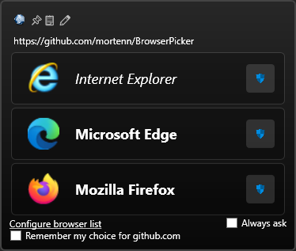

You can easily configure it to use Firefox for `github.com` and `slashdot.org`, but leave Edge to handle `microsoft.com`  
and even let Internet Explorer handle that old internal LOB app you'd rather not use but must.

## Installation
You can find the latest release on [github](https://github.com/mortenn/BrowserPicker/releases).

### Default browser
To enable the browser picker window, you need to set Browser Picker as your default browser. 

### .NET Runtime dependent binary
`BrowserPicker.msi` and `Bundle.zip` are JIT compiled and require you have the .NET 8 runtime installed.

#### Native image generation
As part of installation, `BrowserPicker.msi` will execute ngen to build a native image for your computer.  
This significantly enhances launch times for he executable.  
If you prefer the bundle, you may run `ngen install BrowserPicker.exe` to get the same benefit.

### Portable binary
If you do not want to have the .net runtime installed on your computer, you may download the Portable version, which includes the runtime.

`BrowserPicker-Portable.msi` and `Portable.zip` contain a win-x64 binary executable with embedded .NET runtime.  
This makes the file sizes quite significantly larger, but you do not need an additional runtime to use these.

### Signing certificate
To avoid warnings about unknown publisher, you may [import](https://stackoverflow.com/questions/49039136/powershell-script-to-install-trusted-publisher-certificates) the provided certificate into your certificate store first.

### Manual steps
You need to open the settings app from the start menu, navigate into Apps, select Default apps, then change the Web browser to BrowserPicker.  
Please ensure BrowserPicker can be started before you do this.

## Usage

When you open a link outside a browser, one of these things will happen, in order:

1. If you have previously selected `Always ask`, the browser selection window is shown.
2. If you have set up a configuration rule matching the url being opened, the selected browser will be launched with the url.
3. If you only have one browser running, the link will be opened in that browser.
4. If you have configured a default browser, it will be asked to open the url.
3. Otherwise, you will be presented with a simple window asking you which browser you want to use.  

The url is shown at the top of the window, and if it matches a list of known url shorteners, BrowserPicker will expand this address and show you the real one after a short delay.
If you do not want BrowserPicker to perform this operation (it will call the internet), you may disable this feature in the settings.

### Copy url
You can click the clipboard icon at the top to copy the url without opening it

### Edit url
You can click the pencil icon at the top of the window to edit or copy the url before visiting it or cancelling:

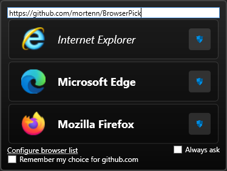

### Keyboard shortcuts

When this window is open and has focus, you can use the following keyboard shortcuts:

`[enter]` or `[1]` Pick the first browser in the list

`[2]` Pick the second browser in the list

...

`[9]` Pick the ninth browser in the list

If you keep `[alt]` pressed while hitting one of these, the browser will be opened in privacy mode.

`[esc]` Abort and close window

If you click outside the window such that it loses focus, it will close without opening the url in any browser.

Each browser that supports it, has a blue shield button on the right side.
Browsers currently supporting privacy mode are firefox, internet explorer, chrome, and edge.

Currently running browsers will have their name in bold, whilst browsers not currently running will have their names in cursive.

As you use the application, it keeps count of how many times you selected each browser. This information is used to show you your browsers in your preferred order automatically.

At the bottom of the window, there is a checkbox to enable "always ask" and a hyperlink to open settings.

## Settings
By simply launching BrowserPicker from the start menu or double clicking the `BrowserPicker.exe` file, you will be presented with a GUI to configure the behaviour.
The configuration is saved in the Windows registry: `HKEY_CURRENT_USER\Software\BrowserPicker`, if you ever need to manually edit it or make a backup.

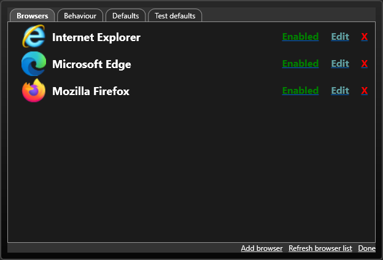

### Browsers

The browser list shows you the browsers BrowserPicker has been configured or detected to use.

#### Disabling browsers
You can disable a browser by clicking `Enabled`, this will hide the browser from the selection list.

#### Removing browsers
If you click the red X, you may remove a browser.

Do note that if it was automatically detected, it will return to the list the next time auto configuration is performed.

#### Automatic configuration
The `Refresh broser list` function gets automatically executed in the background when you use BrowserPicker.
This helps it discovering newly installed browsers, in case a new browser has been installed,

#### Manually adding browser
You may click the hyperlink `Add browser` to open a popup where you may manually add a browser that has not been detected - or some other tool that isn't a browser.

You can click the buttons behind the input boxes to bring up the file picker interface of windows to select the executable or icon file you want to use.

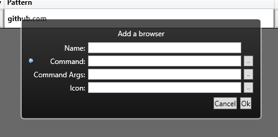
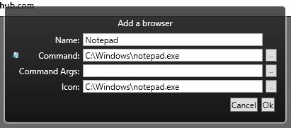

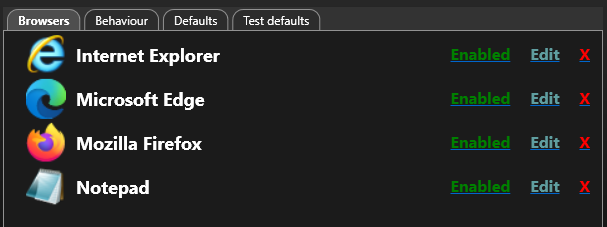

If you browse for the command first, the application will assume the executable also has an icon, and prefill that box.

The name of the application will be attempted to be set automatically based on information in the executable.

##### Chrome profiles

Tip for Chrome Users: If you are using multiple Chrome profiles, by default if you choose Chrome it will launch in the last
profile you launched Chrome with.  To make it possibe for browser picker to select a profile you can create a new browser 
for each profile, set the program to the chrome executable, and add a command line argument to specify which profile to launch:
`--profile-directory=Default` for the first profile, `--profile-directory="Profile 1"` for the second profile, and so on.

Please note that arguments with spaces do require "" around them to be properly passed to chrome.

##### Firefox profiles

Similar configuration should be possible for firefox.

### Behaviour
This tab contains various settings that govern how BrowserPicker operates.

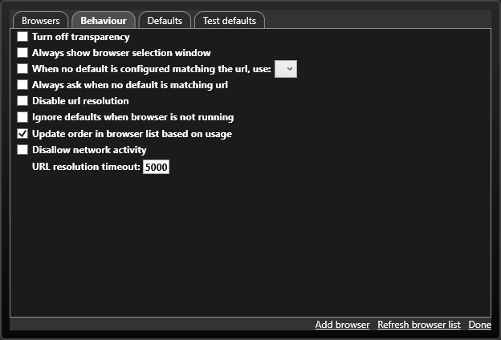

> [ ] Turn off transparency

This will make BrowserPicker have a simple black background, to help with legibility

> [ ] Always show browser selection window

This option is also available on the browser selection window. When enabled, BrowserPicker will always ask the user to make a choice.

> [ ] When no default is configured matching the url, use: [__v]

When configured, BrowserPicker will always use this browser unless a default browser has been configured for that url.

> [ ] Always ask when no default is matching url

This option makes it so BrowserPicker will only pick matched default browsers and otherwise show the selection window.

> [ ] Disable url resolution

> [ ] Ignore defaults when browser is not running

When enabled, configured default browsers only apply when they are already running.

> [ ] Update order in browser list based on usage

This option will make your list of browsers automatically sorted by how often you pick them.

> [ ] Disallow network activity

BrowserPicker may perform DNS and HTTP calls to probe the specified url in order to check if the url redirects elsewhere.  
This option turns this feature off, preventing BrowserPicker to call the network when you launch a url.

> URL resolution timeout: [_____]

You may adjust for how long BrowserPicker attempts to resolve an url here.

### Defaults
The defaults tab lets you configure rules to map certain urls to certain browsers.

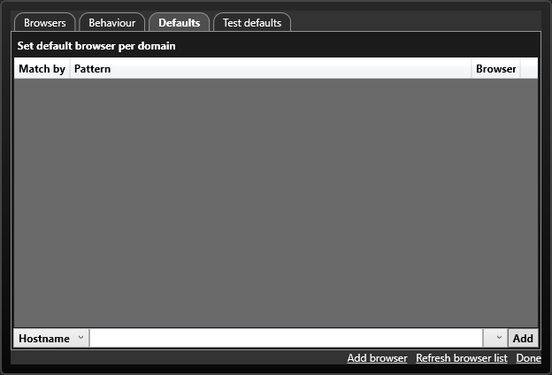

##### Match types
There exists four different match types, but you cannot use Default, that is reserved for use elsewhere.  
The option will eventually get hidden in the interface, but for now it becomes Hostname when selected.

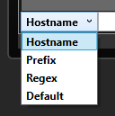

###### Hostname match
The pattern will match the end of the hostname part of the url, ie. `hub.com` would match `https://www.github.com/mortenn/BrowserPicker`, but not `https://example.com/cgi-bin/hub.com`

###### Prefix match
The pattern will match the beginning of the url, ie. `https://github.com/mortenn` would match `https://github.com/mortenn/BrowserPicker` but not `https://www.github.com/mortenn/BrowserPicker`

###### Regex match
The pattern is a .NET regular expression and will be executed against the url, see [.NET regular expressions](https://learn.microsoft.com/en-us/dotnet/standard/base-types/regular-expressions) for details.

##### Browser
The selected browser will be the one to launch for matched urls.

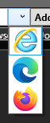

### Test defaults
There is even a handy dandy tool for verifying your settings,  
just paste that url into the big white text box and get instant feedback on the browser selection process:

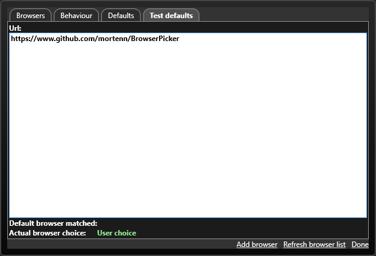