# Browser Picker
A default browser replacement for Windows to let you pick your preferred browser on the fly or in accordance with your own rules.

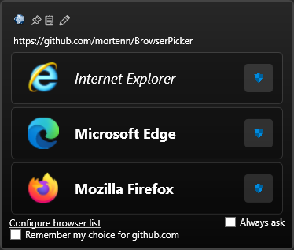

You can easily configure it to use Firefox for `github.com` and `slashdot.org`, but leave Edge to handle `microsoft.com`  
and even let Internet Explorer handle that old internal LOB app you'd rather not use but must.

## Installation
You can find the latest release on [GitHub](https://github.com/mortenn/BrowserPicker/releases).

### Default browser
To enable the browser picker window, you need to set Browser Picker as your default browser. 

### .NET Runtime dependent binary
BrowserPicker.msi and Dependent.zip are JIT compiled and require you have the [.NET 10.0 Desktop Runtime](https://dotnet.microsoft.com/en-us/download/dotnet/10.0) installed.
Direct links: [64bit systems](https://dotnet.microsoft.com/en-us/download/dotnet/thank-you/runtime-desktop-10.0.5-windows-x64-installer), [32bit systems](https://dotnet.microsoft.com/en-us/download/dotnet/thank-you/runtime-desktop-10.0.5-windows-x86-installer).

#### Native image generation
As part of installation, `BrowserPicker.msi` will execute ngen to build a native image for your computer.  
This significantly enhances launch times for the executable.  
If you prefer the bundle, you may run `ngen install BrowserPicker.exe` to get the same benefit.

### Portable binary
If you do not want to have the .net runtime installed on your computer, you may download the Portable version, which includes the runtime.

`BrowserPicker-Portable.msi` and `Portable.zip` contain a win-x64 binary executable with embedded .NET runtime.  
This makes the file sizes quite significantly larger, but you do not need an additional runtime to use these.

### Signing certificate
To avoid warnings about unknown publisher, you may [import](https://stackoverflow.com/questions/49039136/powershell-script-to-install-trusted-publisher-certificates) the provided certificate into your certificate store first.

### Manual steps
You need to open the settings app from the start menu, navigate into Apps, select Default apps, then change the Web browser to Browser Picker.  
Please ensure Browser Picker can be started before you do this.

## Usage

When you open a link outside a browser, one of these things will happen, in order:

1. If you have previously selected `Always ask`, the browser selection window is shown.
2. If you have set up a configuration rule matching the URL being opened, the selected browser will be launched with the URL (when that browser is already running, or when *Use defaults even when browser is not running* is checked in Behaviour).
3. If you only have one browser running, the link will be opened in that browser.
4. If you have configured a fallback default browser, it will be used to open the URL (again only when running, or when the option above is checked).
5. Otherwise, you will be presented with a simple window asking you which browser you want to use.  

The URL is shown at the top of the window, and if it matches a list of known URL shorteners, Browser Picker will expand this address and show you the real one after a short delay.
If you do not want Browser Picker to perform this operation (it will call the internet), you may disable this feature in the settings.

### Copy URL
You can click the clipboard icon at the top to copy the URL without opening it

### Edit URL
You can click the pencil icon at the top of the window to edit or copy the URL before visiting it or cancelling:

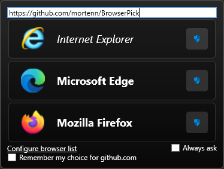


### Keyboard shortcuts

When this window is open and has focus, you can use the following keyboard shortcuts:

`[enter]` or `[1]` Pick the first browser in the list

`[2]` Pick the second browser in the list

...

`[9]` Pick the ninth browser in the list

If you keep `[alt]` pressed while hitting one of these, the browser will be opened in privacy mode.

`[esc]` Abort and close window

If you click outside the window such that it loses focus, it will close without opening the URL in any browser.

Each browser that supports it, has a blue shield button on the right side.
Browsers currently supporting privacy mode are Firefox, Internet Explorer, Chrome, Edge, and Vivaldi.

Currently running browsers will have their name in bold, whilst browsers not currently running will have their names in cursive.

As you use the application, it keeps count of how many times you selected each browser. This information is used to show you your browsers in your preferred order automatically.

At the bottom of the window, there is a checkbox to enable "always ask" and a hyperlink to open settings.

## Settings
By simply launching Browser Picker from the start menu or double clicking the `BrowserPicker.exe` file, you will be presented with a GUI to configure the behaviour.
The configuration is saved in the Windows registry: `HKEY_CURRENT_USER\Software\BrowserPicker`, if you ever need to manually edit it or make a backup.

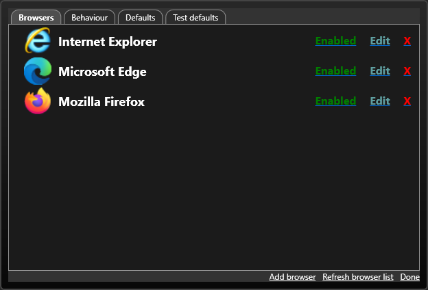

### Browsers

The browser list shows you the browsers Browser Picker has been configured or detected to use.

#### Disabling browsers
You can disable a browser by clicking `Enabled`, this will hide the browser from the selection list.


#### Removing browsers
If you click the red X, you may remove a browser.

Do note that if it was automatically detected, it will return to the list the next time auto configuration is performed.

#### Automatic configuration
The `Refresh browser list` function gets automatically executed in the background when you use Browser Picker.
This helps it discovering newly installed browsers, in case a new browser has been installed,

#### Manually adding browser
You may click the hyperlink `Add browser` to open a popup where you may manually add a browser that has not been detected - or some other tool that isn't a browser.

You can click the buttons behind the input boxes to bring up the file picker interface of windows to select the executable or icon file you want to use.

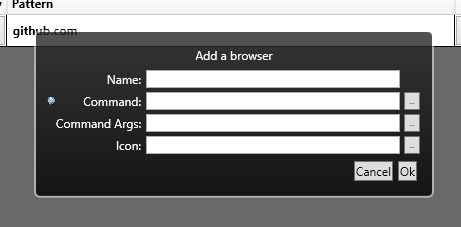
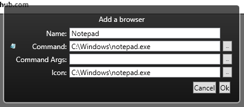

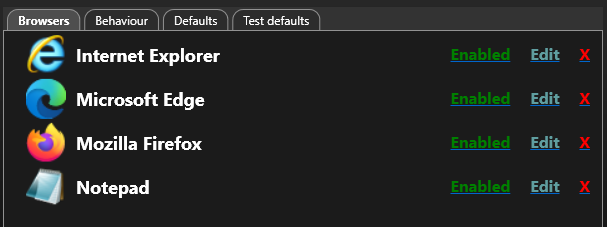

If you browse for the command first, the application will assume the executable also has an icon, and prefill that box.

The name of the application will be attempted to be set automatically based on information in the executable.

##### Chrome profiles

Tip for Chrome Users: If you are using multiple Chrome profiles, by default if you choose Chrome it will launch in the last
profile you launched Chrome with. To make it possible for Browser Picker to select a profile you can create a new browser 
for each profile, set the program to the chrome executable, and add a command line argument to specify which profile to launch:
`--profile-directory=Default` for the first profile, `--profile-directory="Profile 1"` for the second profile, and so on.

Please note that arguments with spaces do require "" around them to be properly passed to chrome.

##### Firefox profiles

Similar configuration should be possible for Firefox.

### Behaviour
This tab contains various settings that govern how Browser Picker operates.

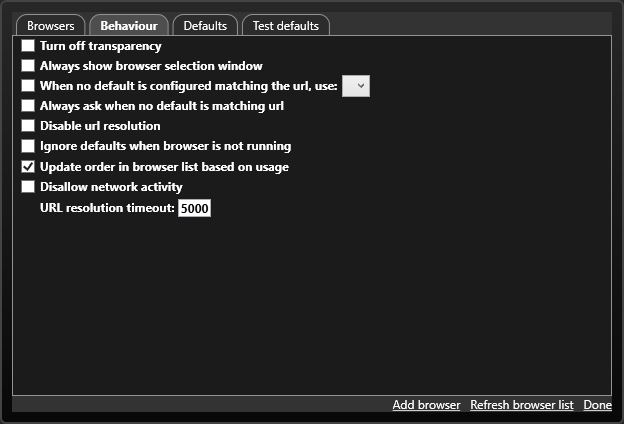

> [ ] Turn off transparency

This will make Browser Picker have a simple black background, to help with legibility

> [ ] Always show browser selection window

This option is also available on the browser selection window. When enabled, Browser Picker will always ask the user to make a choice.

> [ ] When no default is configured matching the URL, use: [__v]

When configured, Browser Picker will always use this browser unless a default browser has been configured for that URL.

> [ ] Always ask when no default is matching URL

This option makes it so Browser Picker will only pick matched default browsers and otherwise show the selection window.

> [ ] Use defaults even when browser is not running

When unchecked, the selection window is shown if your default browser is not running (so you can choose which profile or browser to start). When checked, links always open in your default or fallback browser without showing the selection window, even when no instance is running.

> [ ] Update order in browser list based on usage

This option will make your list of browsers automatically sorted by how often you pick them.

> URL resolution timeout: [_____]

You may adjust for how long Browser Picker attempts to resolve a URL here.

### Security

The security tab controls the automatic network lookups Browser Picker may perform while preparing the picker UI.

> [ ] Probe URL shorteners / redirects
>> [ ] Only for known URL shorteners

When enabled, Browser Picker may request the URL to discover whether it redirects somewhere else before matching defaults or showing the final target. By default this is restricted to configured shortener hosts only.

> [ ] Probe favicon
>> [ ] Only for URLs matching defaults

When enabled, Browser Picker may request the resolved page to discover a favicon for the URL bar in the picker. By default this only happens when the URL matches one of your configured Defaults rules.

> Disable all

Use this button to turn off both automatic probe types at once.

### Defaults
The defaults tab lets you configure rules to map certain URLs to certain browsers.

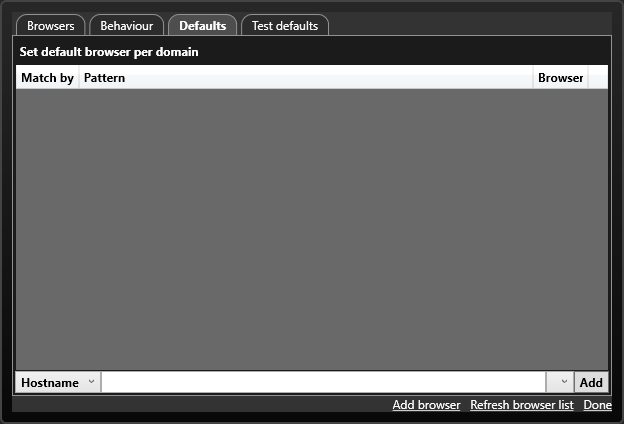

##### Match types
There exists four different match types, but you cannot use Default, that is reserved for use elsewhere.  
The option will eventually get hidden in the interface, but for now it becomes Hostname when selected.

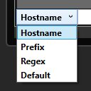

###### Hostname match
The pattern will match the end of the hostname part of the URL, ie. `hub.com` would match `https://www.github.com/mortenn/BrowserPicker`, but not `https://example.com/cgi-bin/hub.com`

###### Prefix match
The pattern will match the beginning of the URL, ie. `https://github.com/mortenn` would match `https://github.com/mortenn/BrowserPicker` but not `https://www.github.com/mortenn/BrowserPicker`

###### Regex match
The pattern is a .NET regular expression and will be executed against the URL, see [.NET regular expressions](https://learn.microsoft.com/en-us/dotnet/standard/base-types/regular-expressions) for details.

##### Browser
The selected browser will be the one to launch for matched URLs.

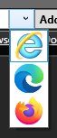

### Test defaults
There is even a handy dandy tool for verifying your settings,  
just paste that URL into the big white text box and get instant feedback on the browser selection process:

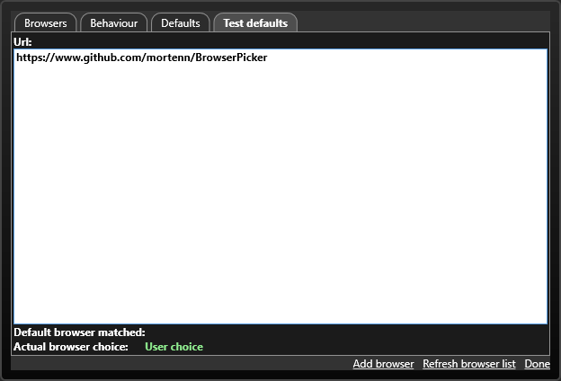

### Logging
Browser Picker uses ILogger with EventLog support.

### Adjusting log levels
Browser Picker uses the standard .NET logging configuration from `appsettings.json`.

The most useful settings are:

- `Logging:LogLevel:Default` controls the general runtime log level used by the app, including what ends up in the in-app feedback log.
- `Logging:EventLog:LogLevel:BrowserPicker` controls what is written to the Windows Event Log for the `BrowserPicker` source.

The shipped defaults are:

- `Logging:LogLevel:Default = Information`
- `Logging:EventLog:LogLevel:BrowserPicker = Warning`

If you want more detailed logs while troubleshooting, you can raise one or both of those levels in `appsettings.json`, for example:

```json
{
  "Logging": {
    "LogLevel": {
      "Default": "Debug",
      "System": "Information",
      "Microsoft": "Information"
    },
    "EventLog": {
      "LogLevel": {
        "Default": "Warning",
        "BrowserPicker": "Information"
      }
    }
  }
}
```

You can also override those values using standard .NET configuration environment variables such as:

- `Logging__LogLevel__Default=Debug`
- `Logging__EventLog__LogLevel__BrowserPicker=Information`

The Feedback tab also has a log level dropdown, but that only filters what is shown in the viewer. It does not change what the application captures at startup.

If you are using the archived version rather than the installer package,
you will need to run this powershell command before logs will appear:

```powershell
New-EventLog -LogName Application -Source BrowserPicker
```
