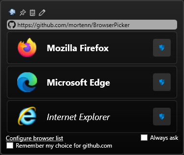

# 浏览器选择器（Browser Picker）

[English](/readme_en.md) | 中文

一款适用于 Windows 系统的默认浏览器替代工具，可让你选择偏好的浏览器，或根据自定义规则自动选择浏览器。

你可以轻松配置规则：例如用 Firefox 打开 `GitHub.com` 和 `slashdot.org`，用 Edge 处理 `microsoft.com`，甚至可以让 Internet Explorer 打开那款你不想用但又必须使用的旧版内部业务线（LOB）应用。

## 安装

你可在 [GitHub](https://github.com/XTsat/BrowserPicker/releases) 上获取最新版本。

### 设置默认浏览器

要启用浏览器选择器窗口，需将 “浏览器选择器” 设为系统默认浏览器。

### 依赖 .NET 运行时的安装包

BrowserPicker.msi 和 Dependent.zip 为即时编译（JIT）版本，需安装 [.NET 9.0 桌面运行时](https://dotnet.microsoft.com/en-us/download/dotnet/9.0) 才能使用。直接下载链接：[64 位系统](https://dotnet.microsoft.com/en-us/download/dotnet/thank-you/runtime-desktop-9.0.3-windows-x64-installer)、[32 位系统](https://dotnet.microsoft.com/en-us/download/dotnet/thank-you/runtime-desktop-9.0.3-windows-x86-installer)。

#### 原生镜像生成

安装过程中，`BrowserPicker.msi` 会执行 ngen 工具为你的电脑生成原生镜像，这能显著提升可执行文件的启动速度。若你选择压缩包版本，可运行命令 `ngen install BrowserPicker.exe` 以获得相同优化效果。

### 便携版安装包

若不想在电脑上安装 .NET 运行时，可下载包含运行时的便携版。

`BrowserPicker-Portable.msi` 和 `Portable.zip` 包含适用于 win-x64 系统的可执行文件，且已嵌入 .NET 运行时。该版本文件体积会显著增大，但无需额外安装运行时即可使用。

### 签名证书

为避免 “未知发布者” 警告，可先将提供的证书导入你的证书存储区，导入方法参考 [此处](https://stackoverflow.com/questions/49039136/powershell-script-to-install-trusted-publisher-certificates)。

### 手动设置步骤

1.从开始菜单打开 “设置” 应用；
2.进入 “应用” 选项；
3.选择 “默认应用”；
4.将 “网页浏览器” 改为 “浏览器选择器”。
    **注意**：执行此操作前，请确保 “浏览器选择器” 可正常启动。

## 使用方法

当你在浏览器外打开链接时，会按以下优先级触发操作：

1. 若此前选择过 **始终询问**，则显示浏览器选择窗口
2. 若已配置与当前链接匹配的规则，则用指定浏览器打开该链接
3. 若仅有一个浏览器处于运行状态，则在该浏览器中打开链接
4. 若已配置默认浏览器，则调用默认浏览器打开链接
5. 若以上情况均不满足，则显示简易窗口，让你选择要使用的浏览器

链接地址会显示在窗口顶部：若该地址属于已知短链接服务，浏览器选择器会在短暂延迟后解析真实地址并显示。
若你不希望浏览器选择器执行此操作（该操作需连接网络），可在设置中禁用此功能。

### 复制链接

点击窗口顶部的剪贴板图标，可复制链接地址而不打开链接。

### 编辑链接

点击窗口顶部的铅笔图标，可在访问或取消访问链接前编辑或复制链接地址：

### 键盘快捷键

当浏览器选择窗口处于打开并获得焦点的状态时，可使用以下快捷键：
按住 [Alt] 键并按下数字键，可在隐私模式下打开对应浏览器。

- [Enter] 或 [1]：选择列表中的第一个浏览器
- [2]：选择列表中的第二个浏览器
- ...
- [9]：选择列表中的第九个浏览器
- [Esc]：取消操作并关闭窗口

若点击窗口外部导致窗口失去焦点，窗口会关闭且不会用任何浏览器打开链接。

当前处于运行状态的浏览器，其名称会以粗体显示；未运行的浏览器，名称会以斜体显示。

在你使用该应用的过程中，它会统计你选择各浏览器的次数，并根据这些数据自动按你的偏好顺序排列浏览器列表。

窗口底部有一个 **始终询问** 复选框，以及一个用于打开设置界面的超链接。

## 设置

从开始菜单启动 “浏览器选择器”，或双击 `BrowserPicker.exe` 文件，即可打开图形化界面（GUI）配置其行为。

配置信息保存在 Windows 注册表中，路径为 `HKEY_CURRENT_USER\Software\BrowserPicker`，你可在此路径下手动编辑配置或创建备份。

### 浏览器

浏览器列表显示 “浏览器选择器” 已配置或检测到的可用浏览器。

#### 禁用浏览器

点击 **已启用（Enabled）** 可禁用对应浏览器，禁用后该浏览器会从选择列表中隐藏。

#### 删除浏览器

点击红色 “X” 图标可删除对应浏览器。

注意：若该浏览器是自动检测到的，下次执行自动配置时会重新出现在列表中。

#### 自动配置

使用 “浏览器选择器” 时，**刷新浏览器列表** 功能会在后台自动执行，帮助检测新安装的浏览器。

#### 手动添加浏览器

点击 **添加浏览器** 超链接，会弹出一个窗口，你可在此手动添加未被检测到的浏览器，或添加非浏览器类工具。
点击输入框后方的按钮，可打开 Windows 文件选择界面，选择要使用的可执行文件或图标文件。

若你先选择可执行文件，应用会默认该文件包含图标，并自动填充图标文件输入框。

应用名称会尝试根据可执行文件中的信息自动设置。

##### Chrome 配置文件

Chrome 用户提示：若你使用多个 Chrome 配置文件，默认情况下选择 Chrome 时，会使用上次启动 Chrome 时的配置文件。

若想让浏览器选择器能指定配置文件，可为每个配置文件创建一个 “新浏览器” 条目：将程序路径设为 Chrome 可执行文件，并添加命令行参数指定要启动的配置文件，例如：

- 第一个配置文件：--profile-directory=Default
- 第二个配置文件：--profile-directory="Profile 1"
- 第三个配置文件：--profile-directory="Profile 2"
    以此类推。

注意：含空格的参数需用英文双引号（" "）包裹，才能正确传递给 Chrome。

##### Firefox 配置文件

Firefox 也支持类似的配置文件设置。

### 行为

此标签页包含控制 “浏览器选择器” 运行方式的各类设置。

> [ ] 关闭透明度

勾选后，浏览器选择器会使用纯色黑色背景，提升文字可读性。

> [ ] 始终显示浏览器选择窗口

此选项在浏览器选择窗口中也可设置。启用后，浏览器选择器会始终提示你选择浏览器。

> [ ] 当无匹配链接的默认浏览器时，使用：[__v]

配置后，除非为当前链接设置了默认浏览器，否则浏览器选择器会始终使用此处指定的浏览器。

> [ ] 无匹配默认浏览器时始终询问

启用此选项后，浏览器选择器仅会使用匹配的默认浏览器；若无匹配项，则显示选择窗口。

> [ ] 禁用链接解析
>
> [ ] 浏览器未运行时忽略默认设置

启用后，已配置的默认浏览器仅在处于运行状态时才生效。

> [ ] 根据使用情况更新浏览器列表顺序

启用后，浏览器列表会根据你的选择频率自动排序。

> [ ] 禁止网络活动

浏览器选择器可能会通过 DNS 查询和 HTTP 请求探测链接，以检查该链接是否存在重定向。

勾选此选项可关闭该功能，避免浏览器选择器在打开链接时连接网络。

> 链接解析超时时间：[___]

在此处调整浏览器选择器尝试解析链接的最长时间。

### 默认规则

此标签页可配置规则，将特定链接与指定浏览器关联。

#### 匹配类型

共有四种匹配类型，其中 **默认（Default）** 类型为预留选项，暂不可用。该选项最终会从界面中隐藏，目前选择后会自动转为 **主机名（Hostname）** 匹配类型。

##### 主机名匹配

规则会匹配链接 **主机名** 部分的末尾。

例如，`hub.com` 会匹配 `https://www.github.com/mortenn/BrowserPicker`，但不会匹配 `https://example.com/cgi-bin/hub.com`

##### 前缀匹配

规则会匹配链接的开头。例如，`https://github.com/mortenn` 会匹配 `https://github.com/mortenn/BrowserPicker`，但不会匹配 `https://www.github.com/mortenn/BrowserPicker`

##### 正则表达式匹配

规则使用 .NET 正则表达式，会对整个链接执行匹配。详情可参考 [.NET 正则表达式文档](https://learn.microsoft.com/en-us/dotnet/standard/base-types/regular-expressions)。

#### 匹配浏览器

选择匹配链接后要启动的浏览器。

### 测试默认规则

界面提供了便捷的规则验证工具：
在白色文本框中粘贴链接，即可即时查看浏览器选择结果（验证规则是否生效）：

### 日志

浏览器选择器使用 ILogger 记录日志，并支持事件日志（EventLog）功能。

如需详细日志，可通过以下两种方式操作：

- 修改 appsettings.json 文件
- 将环境变量 `Logging__EventLog__LogLevel__BrowserPicker` 设置为 **Information（信息级）** 或 **Debug（调试级）**。

默认情况下，仅记录警告（Warning）及更高级别的事件。

若你使用的是压缩包版本（非安装包），需先运行以下 PowerShell 命令，日志才能正常显示：
`New-EventLog -LogName Application -Source BrowserPicker`
